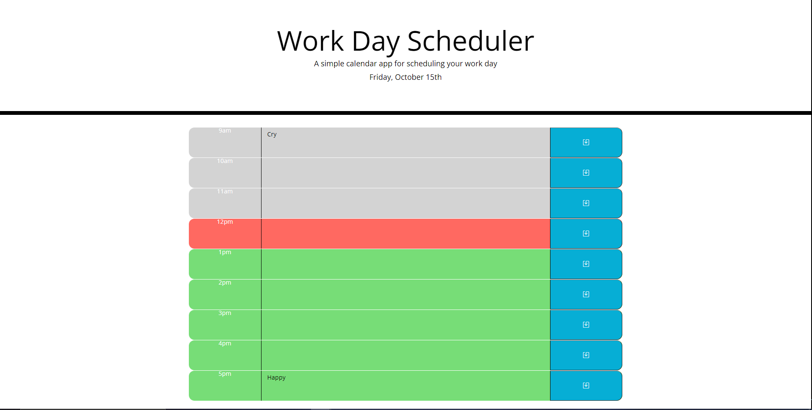

# MoeC-Scheduler
AS AN employee with a busy schedule
I WANT to add important events to a daily planner
SO THAT I can manage my time effectively

Schedule planner which displays current time with general working hours from 9am - 5pm.
User can enter a description into any row and locally save it by clicking on the save button.
If the hour is passed, the row will highlight grey.
If the hour is still to come, the row will highlight green.
And if the hour is present, the row will highlight red.

#Screenshot

#Links
GitHub Repo: https://github.com/moeac/MoeC-Scheduler.git  
Website Link: https://moeac.github.io/MoeC-Scheduler/